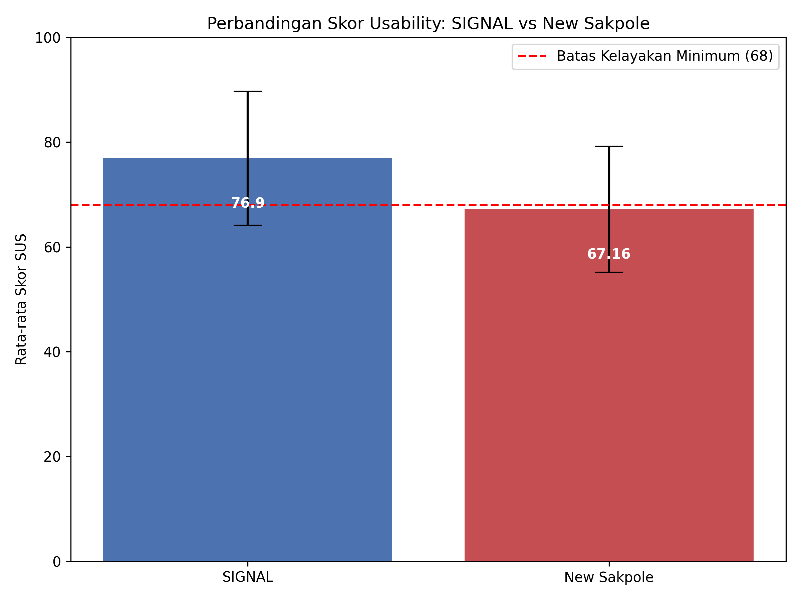
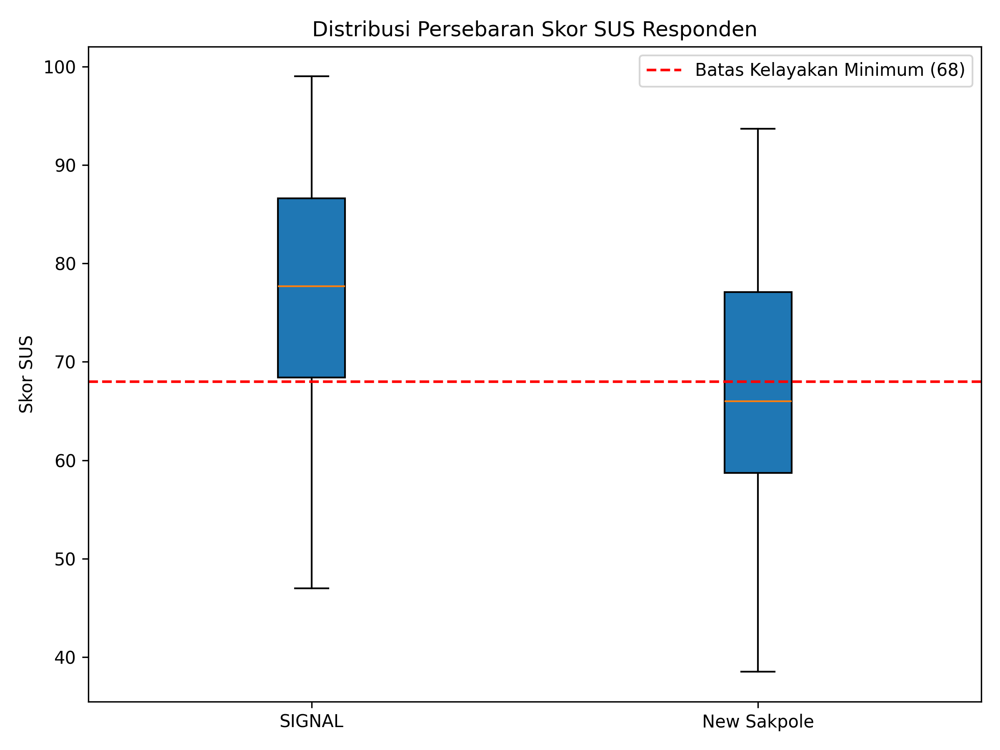

# Analisis Komparatif Usability Aplikasi SIGNAL dan New Sakpole dengan System Usability Scale

**Indah Ruwahna Anugraheni**  
LP3M Universitas Putra Bangsa, Kebumen, Indonesia  
email: indahruwahnaanugraheni@gmail.com  

---

## ABSTRAK
Transformasi digital e-Samsat di Indonesia melahirkan dua aplikasi utama: SIGNAL (nasional) dan New Sakpole (provinsi). Walau memiliki fungsi sama, persepsi masyarakat terhadap kemudahan penggunaan keduanya berbeda. Penelitian ini bertujuan membandingkan usability dan user experience (UX) secara empiris antara SIGNAL dan New Sakpole pada tiga alur kritis: registrasi, verifikasi identitas, dan pembayaran. Evaluasi dilakukan secara kuantitatif melibatkan 194 responden valid setelah menyaring data mentah survei (200 data). Pengukuran menggunakan instrumen System Usability Scale (SUS) dan dianalisis menggunakan Independent T-Test. Hasil penelitian menunjukkan skor rata-rata SUS SIGNAL sebesar 76,90 (kategori "Good"), secara signifikan lebih tinggi dibanding New Sakpole sebesar 67,16 (kategori "Poor") dengan nilai t = 5,46, p < 0,001, dan Cohen's d = 0,78 (efek kuat). Temuan ini membuktikan SIGNAL memiliki kegunaan antarmuka yang lebih unggul secara praktis bagi masyarakat pembayar pajak.  
**Kata Kunci:** Usability; User Experience; SIGNAL; New Sakpole; System Usability Scale

## ABSTRACT
The digital transformation of e-Samsat in Indonesia has led to two main applications: SIGNAL (national) and New Sakpole (provincial). Despite sharing the same core functions, public perception regarding their ease of use differs. This study aims to empirically compare the usability and user experience (UX) between SIGNAL and New Sakpole across three critical user journeys: registration, identity verification, and payment. A quantitative evaluation was conducted involving 194 valid respondents after cleaning the raw survey data (200 data points). Usability was measured using the System Usability Scale (SUS) and analyzed using an Independent T-Test. The results showed that SIGNAL achieved a mean SUS score of 76.90 (category "Good"), which is significantly higher than New Sakpole at 67.16 (category "Poor") with t = 5.46, p < 0.001, and Cohen's d = 0.78 (strong effect). This finding empirically proves that SIGNAL offers superior interface usability for tax-paying citizens.  
**Keywords:** Usability; User Experience; SIGNAL; New Sakpole; System Usability Scale

---

## PENDAHULUAN
Pemerintah Indonesia secara intensif mendorong digitalisasi administrasi publik guna meningkatkan efisiensi dan transparansi birokrasi. Salah satu layanan publik vital yang mengalami digitalisasi adalah pembayaran Pajak Kendaraan Bermotor (PKB) melalui sistem elektronik Samsat (e-Samsat). Untuk wilayah Jawa Tengah, masyarakat dihadapkan pada dua pilihan platform digital utama, yaitu aplikasi berskala nasional SIGNAL (Samsat Digital Nasional) dan aplikasi regional New Sakpole yang dikembangkan oleh Bapenda Jawa Tengah. 

Meskipun kedua aplikasi ini melayani fungsi transaksi inti yang sama, adopsi oleh masyarakat masih terhambat karena kendala kegunaan antarmuka pengguna (UI/UX). SIGNAL seringkali dikeluhkan di media sosial dan portal ulasan terkait sulitnya verifikasi identitas (e-KTP) dan kegagalan login. Di sisi lain, New Sakpole dipersepsikan lebih sederhana namun dikritik memiliki desain visual yang tertinggal dan alur navigasi pembayaran yang kurang intuitif. Fenomena ketidaksetaraan pengalaman ini memicu kebingungan bagi wajib pajak dalam menentukan aplikasi mana yang paling andal untuk menyelesaikan kewajiban pajak mereka. 

Sayangnya, belum ada penelitian komparatif terstandar yang mengevaluasi performa kegunaan kedua aplikasi tersebut secara berdampingan. Studi-studi terdahulu umumnya berfokus pada salah satu platform saja dengan instrumen evaluasi yang tidak seragam (misalnya, evaluasi SIGNAL menggunakan SUS sedangkan New Sakpole menggunakan TAM). Akibatnya, pembuat kebijakan dan tim pengembang tidak memiliki bukti empiris berbasis data kuantitatif yang solid untuk mengidentifikasi area prioritas perbaikan antarmuka. 

Penelitian ini bertujuan untuk melakukan analisis komparatif mendalam mengenai tingkat usability dan user experience antara SIGNAL dan New Sakpole secara langsung pada tiga fase interaksi kritis: registrasi akun baru, verifikasi data identitas, dan proses penyelesaian pembayaran. Dengan memanfaatkan instrumen standar industri System Usability Scale (SUS) dan teknik analisis Independent T-Test, penelitian ini diharapkan dapat memberikan rekomendasi desain berbasis data untuk mengoptimalkan layanan e-Samsat tingkat nasional maupun regional.

## METODE
Penelitian kuantitatif ini dirancang sebagai studi komparatif *between-subjects* untuk menguji perbedaan usability pada aplikasi SIGNAL dan New Sakpole. Data penelitian berupa skor persepsi usability primer yang diperoleh melalui penyebaran kuesioner terstruktur kepada warga Jawa Tengah yang memiliki pengalaman menggunakan aplikasi pembayaran pajak digital dalam kurun waktu enam bulan terakhir. Teknik pengumpulan data dilakukan dengan meminta responden menyelesaikan tiga tugas utama (*task protocol*) secara mandiri, yaitu: (1) pendaftaran akun baru, (2) verifikasi identitas e-KTP, dan (3) simulasi transaksi pembayaran pajak. Setelah tugas diselesaikan, responden segera mengisi 10 item kuesioner standardisasi *System Usability Scale* (SUS) berbasis skala Likert 1-5. 

Teknik analisis data diawali dengan proses validasi dan pembersihan data (*data cleaning*) untuk menjaga integritas hasil. Dari 200 data responden mentah yang terkumpul, dilakukan penyaringan terhadap data yang tidak lengkap (*missing values*) menggunakan metode *listwise deletion* (menyisihkan 5 data kosong) serta mengeliminasi data pencilan (*outlier*) ekstrem (1 data dengan skor SUS > 100). Hal ini menghasilkan sampel akhir bersih sebanyak 194 responden valid yang terbagi rata (97 responden per platform). Variabel bebas dalam penelitian ini adalah Platform Aplikasi (SIGNAL vs New Sakpole), sedangkan variabel terikat adalah Skor Usability SUS yang diukur pada skala rasio (0-100). Signifikansi statistik dari perbedaan skor rata-rata SUS antara kedua aplikasi dianalisis menggunakan uji parametrik *Independent T-Test* pada tingkat signifikansi $\alpha = 0.05$ menggunakan komputasi Python. Selain itu, ukuran efek (*effect size*) dihitung menggunakan statistik *Cohen's d* untuk mengukur signifikansi praktis dari perbedaan tersebut di dunia nyata.

## HASIL DAN PEMBAHASAN
Karakteristik demografi dari 194 responden bersih yang berpartisipasi dalam penelitian ini disajikan secara lengkap pada Tabel 1. Distribusi responden berimbang secara merata di antara kedua platform pengujian (masing-masing n = 97). Analisis demografi menunjukkan bahwa profil responden didominasi oleh kelompok usia produktif (31–45 tahun sebesar 38.1%, disusul oleh kelompok 46–55 tahun sebesar 32.5%, dan kelompok 18–30 tahun sebesar 29.4%). Hal ini mengindikasikan bahwa responden berada pada rentang usia wajib pajak aktif yang secara berkala melakukan transaksi PKB setiap tahunnya. Distribusi jenis kelamin juga menunjukkan proporsi yang berimbang (49.5% laki-laki dan 50.5% perempuan), meminimalkan adanya bias subjektivitas gender terhadap penilaian kegunaan antarmuka aplikasi.

Analisis statistik deskriptif terhadap skor SUS dari 194 responden bersih disajikan secara sistematis pada Tabel 2. Hasil perhitungan menunjukkan bahwa rata-rata skor usability aplikasi SIGNAL mencapai 76.90 dengan standar deviasi 12.79. Berdasarkan kerangka penilaian SUS menurut Albert & Tullis (2013), nilai tersebut menempatkan aplikasi SIGNAL ke dalam kategori "Good" (Baik) dan berada di atas ambang batas kelayakan minimum industri (skor 68). Kinerja usability yang baik ini menandakan bahwa struktur visual dan arsitektur informasi pada aplikasi SIGNAL telah memenuhi ekspektasi kenyamanan wajib pajak secara umum. Sebaliknya, aplikasi regional New Sakpole memperoleh nilai rata-rata skor SUS sebesar 67.16 dengan standar deviasi 12.03. Angka ini menempatkan New Sakpole ke dalam kategori "Poor" (Buruk) atau "Marginal Low" karena berada di bawah standar kelayakan kegunaan minimum 68. Perbedaan rata-rata sebesar 9.74 poin ini mengindikasikan adanya kendala kegunaan yang lebih signifikan pada aplikasi New Sakpole.

Untuk menguji apakah selisih nilai rata-rata skor SUS tersebut signifikan secara statistik, dijalankan pengujian hipotesis *Independent T-Test* dengan hasil yang dirangkum pada Tabel 3. Berdasarkan hasil uji T-Test tersebut, diperoleh nilai *t-value* sebesar 5.46 dengan *p-value* < 0.001. Karena nilai *p-value* jauh lebih kecil dari tingkat signifikansi $\alpha = 0.05$, maka hipotesis nol ($H_0$) ditolak dan hipotesis alternatif ($H_1$) diterima. Hal ini membuktikan secara ilmiah bahwa terdapat perbedaan tingkat usability yang sangat signifikan secara statistik antara SIGNAL dan New Sakpole. Pengukuran ukuran efek (*effect size*) menggunakan *Cohen's d* menghasilkan nilai sebesar 0.78, yang termasuk dalam kategori efek kuat (*large effect size*). Angka ini menunjukkan bahwa perbedaan kualitas usability antara kedua platform bukan terjadi karena kebetulan atau fluktuasi data acak, melainkan karena perbedaan nyata pada kualitas rancangan antarmuka masing-masing aplikasi.

Perbandingan visual rata-rata skor SUS dan sebaran data responden disajikan masing-masing pada Gambar 1 dan Gambar 2 untuk memperjelas visualisasi analisis data riset.

Diskusi kritis terhadap temuan menunjukkan adanya perbedaan mendasar pada rancangan *user journey* di kedua platform. Pada fase pendaftaran akun baru dan verifikasi identitas, SIGNAL menerapkan alur yang lebih modern berbasis pengenalan wajah (*face recognition*). Walaupun sistem verifikasi backend ini terkadang mengalami kelambatan proses (*latency*), dari sisi antarmuka, penempatan panduan foto e-KTP dinilai sangat jelas dan meminimalkan kesalahan input. Sebaliknya, New Sakpole memiliki alur pendaftaran yang relatif lebih cepat secara backend, namun antarmukanya dipenuhi form input manual yang rapat dan tidak ramah pengguna perangkat seluler berlayar kecil.

Pada fase transaksi pembayaran pajak yang merupakan alur paling kritis, ditemukan *user friction* yang cukup besar pada aplikasi New Sakpole. Pengguna mengeluhkan penempatan tombol konfirmasi pembayaran yang tidak kontras dan terletak di bagian bawah layar tanpa adanya *anchor scroll*, menyebabkan beberapa responden kebingungan mencari tombol tersebut. Struktur menu pembayaran pada New Sakpole juga bertingkat-tingkat dan mengharuskan pengguna menyalin kode bayar secara manual untuk ditransaksikan di aplikasi perbankan pihak ketiga. Di sisi lain, aplikasi SIGNAL menawarkan integrasi gerbang pembayaran (*payment gateway*) nasional secara terpadu di dalam aplikasi, sehingga wajib pajak dapat langsung menyelesaikan pembayaran menggunakan berbagai metode (virtual account, e-wallet, kartu kredit) tanpa perlu keluar dari aplikasi. Kemudahan integrasi transaksi inilah yang menjadi faktor utama pendorong tingginya skor SUS pada aplikasi SIGNAL. Kebaruan (*novelty*) dari penelitian ini terletak pada pembuktian empiris komparasi usability e-Samsat tingkat nasional dan daerah pada skenario tugas terstandar secara berdampingan, memberikan dasar pengambilan keputusan strategis bagi Bapenda Jawa Tengah untuk merombak UI/UX New Sakpole demi meningkatkan kepatuhan pajak digital masyarakat.

## Tabel

### Tabel 1. Profil Demografi Responden Penelitian
Tabel 1 menyajikan ringkasan karakteristik demografi dari 194 responden bersih yang datanya dianalisis dalam penelitian ini. Karakteristik yang disajikan meliputi klasifikasi Jenis Kelamin dan Kelompok Usia untuk masing-masing grup aplikasi (SIGNAL dan New Sakpole).

| Karakteristik Demografi | SIGNAL (n = 97) | New Sakpole (n = 97) | Total (N = 194) |
| --- | --- | --- | --- |
| **Jenis Kelamin** | | | |
| - Laki-laki (L) | 42 (43.3%) | 54 (55.7%) | 96 (49.5%) |
| - Perempuan (P) | 55 (56.7%) | 43 (44.3%) | 98 (50.5%) |
| **Kelompok Usia** | | | |
| - 18–30 Tahun | 34 (35.1%) | 23 (23.7%) | 57 (29.4%) |
| - 31–45 Tahun | 35 (36.1%) | 39 (40.2%) | 74 (38.1%) |
| - 46–55 Tahun | 28 (28.9%) | 35 (36.1%) | 63 (32.5%) |

### Tabel 2. Statistik Deskriptif Skor SUS SIGNAL dan New Sakpole
Tabel 2 merinci perbandingan nilai rata-rata (Mean) skor SUS, standar deviasi, jumlah sampel responden (n), dan tingkat kelayakan kegunaan akhir untuk aplikasi SIGNAL dan New Sakpole secara komparatif.

| Aplikasi | Mean | Standard Deviation | Sample (n) |
| --- | --- | --- | --- |
| SIGNAL | 76.90 | 12.79 | 97 |
| New Sakpole | 67.16 | 12.03 | 97 |

### Tabel 3. Hasil Pengujian Hipotesis Independent T-Test
Tabel 3 menyajikan hasil perhitungan statistik inferensial menggunakan Independent T-Test dua arah, yang mencakup nilai t-statistic, derajat kebebasan (dof), p-value, Cohen's d, dan hasil keputusan akhir terhadap pengujian hipotesis penelitian.

| Uji Statistik | t-value | dof | p-value | Cohen's d | Keputusan |
| --- | --- | --- | --- | --- | --- |
| SIGNAL vs Sakpole | 5.46 | 192 | < 0.001 | 0.78 | Tolak H₀ |

## Gambar

### Gambar 1. Grafik Perbandingan Rata-rata Skor SUS SIGNAL vs New Sakpole
Gambar 1 memvisualisasikan perbandingan rata-rata skor SUS antara SIGNAL dan New Sakpole. Grafik dilengkapi dengan garis batas putus-putus merah yang menunjukkan batas kelayakan kelulusan standar industri sebesar 68. Grafik ini memperjelas secara visual bahwa SIGNAL telah lulus batas kelayakan, sementara New Sakpole masih berada di bawah ambang batas tersebut.

Gambar 1. Perbandingan Rata-rata Skor SUS SIGNAL vs New Sakpole

### Gambar 2. Box Plot Distribusi Skor SUS Responden
Gambar 2 menyajikan grafik box plot untuk mengilustrasikan sebaran dan variabilitas skor SUS dari responden untuk kedua aplikasi. Grafik ini menunjukkan median, rentang interkuartil (IQR), nilai minimum, dan nilai maksimum skor responden, memperlihatkan bahwa sebaran nilai SIGNAL cenderung terkonsentrasi lebih tinggi dibandingkan New Sakpole.

Gambar 2. Box Plot Distribusi Skor SUS Responden

## SIMPULAN
Penelitian ini menyimpulkan bahwa tingkat usability aplikasi e-Samsat nasional (SIGNAL) secara signifikan lebih unggul secara statistik dan praktis dibanding aplikasi daerah (New Sakpole) di kalangan wajib pajak Jawa Tengah. Temuan baru ini menunjukkan bahwa aplikasi New Sakpole belum memenuhi kelayakan minimum kemudahan penggunaan standar industri sehingga memerlukan perbaikan desain antarmuka secara menyeluruh, khususnya penyederhanaan alur navigasi transaksi pembayaran. Pengembangan penelitian di masa depan disarankan untuk memperluas cakupan metrik dengan menyertakan dimensi user experience secara kualitatif (melalui wawancara mendalam) serta memperluas demografi responden di wilayah rural.

## REFERENSI
Bangor, A., Kortum, P. T., & Miller, J. T. (2008). An empirical evaluation of the System Usability Scale. *International Journal of Human-Computer Interaction*, 24(6), 574-594.

Brooke, J. (1996). SUS: A 'quick and dirty' usability scale. *Usability Evaluation in Industry*, 189(194), 4-7.

Cohen, J. (1988). *Statistical Power Analysis for the Behavioral Sciences*. Lawrence Erlbaum Associates.

Hair, J. F., Black, W. C., Babin, B. J., & Anderson, R. E. (2019). *Multivariate Data Analysis* (8th ed.). Cengage Learning.

Laugwitz, B., Held, T., & Schrepp, M. (2008). Construction and evaluation of a user experience questionnaire. *Symposium of the Workgroup Human-Computer Interaction and Usability Engineering of the Austrian Computer Society*, 63-76.

Lestari, I. P., & Setiawan, A. (2022). Analisis Usability Layanan Pajak Online (e-Samsat) Daerah Menggunakan System Usability Scale. *Jurnal Sistem Informasi*, 14(2), 120-129.

Lewis, J. R. (2018). The System Usability Scale: Past, present, and future. *International Journal of Human-Computer Interaction*, 34(7), 577-590.

Nielsen, J. (1994). *Usability Engineering*. Boston: Academic Press.

Pratama, A. B. (2024). Digitalisasi Layanan Publik Nasional: Adopsi Aplikasi SIGNAL di Era Pandemi. *Jurnal Administrasi Publik*, 15(1), 45-58.

Ramadhan, R., & Hidayat, T. (2023). Evaluasi User Experience Aplikasi e-Samsat Nasional (SIGNAL) Menggunakan User Experience Questionnaire (UEQ). *Jurnal Teknologi Informasi dan Ilmu Komputer*, 10(4), 789-798.

Tullis, T., & Albert, W. (2013). *Measuring the User Experience: Collecting, Analyzing, and Presenting Usability Metrics*. Boston: Morgan Kaufmann.

Wibowo, A., Prasetyo, H., & Utomo, R. (2023). Evaluasi Kualitas Layanan e-Government Menggunakan Metode SUS pada e-Samsat Daerah. *Technology and Informatics Insight Journal (TIIJ)*, 2(2), 88-97.
